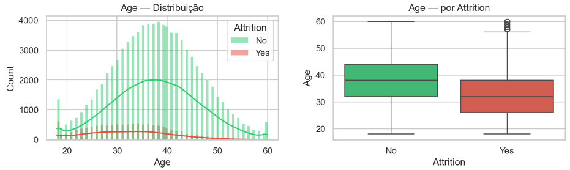
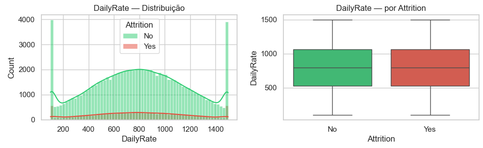
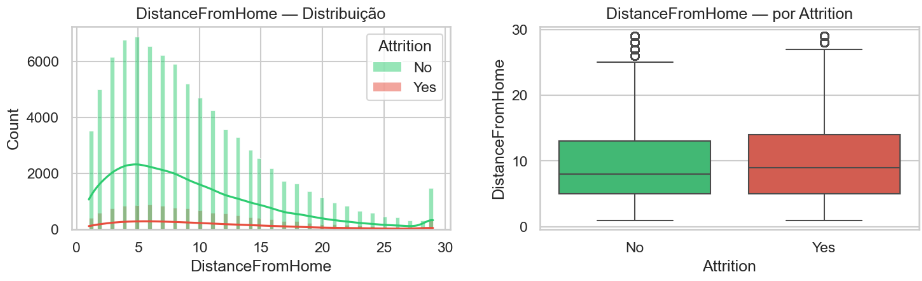

# Hipóteses com base na Análise Exploratória

# Objetivo

Realizaremos análises visuais para todas as variáveis disponíveis no dataset. Com base nessas anállises e nos gráficos gerados, realizaremos hipóteses. Após a finalização dessas análises realizaremos as seleções de features e iremos validar estatísticamente se a nossa hipótese é correta.

- EDA               →  levanta hipóteses visuais (rápido)
- Seleção Features  →  confirma com estatística (preciso)

Na EDA, a análise visual serve para levantar hipóteses e na seleção de features realizamos a validação das hipóteses. Isso evita dois erros comuns:

- Erro 1 — Descartar uma feature visualmente que estatisticamente é importante
- Erro 2 — Manter uma feature visualmente "bonita" que estatisticamente não importa

# Hipóteses

## Variável - Age

- Histograma: 

Curvas separadas, Yes está assimetricamente para a esquerda

- Boxplot:

Mediana Yes < mediana No. Outliers no grupo Yes mas sem necessidade de tratamento. Há pessoas mais velhas que são apontadas como outliers, porém uma pessoa de 55 anos é um valor real e plausível, não dizemos que é um erro de dados.

**Conclusão:**

- Age é uma boa feature para o modelo
- Hipótese: funcionários mais jovens têm maior probabilidade de attrition.
- Status: ⏳ pendente validação estatística

## Variável - DailyRate

- Histograma: 

As curvas estão SOBREPOSTAS — a vermelha acompanha a verde
→ não existe uma faixa de DailyRate onde Yes se concentra mais.

→ quem sai está distribuído igualmente em todos os salários diários

- Boxplot:

Os dois grupos têm distribuição muito parecida
→ DailyRate não diferencia quem sai de quem fica

**Conclusão**:

- Histograma: curvas sobrepostas, Yes distribuído uniformemente
- Boxplot: medianas praticamente iguais (~800), IQR similar entre grupos
- Hipótese: DailyRate não diferencia quem sai de quem fica
- Status: ⏳ pendente validação estatística

## Variável - DistanceFromHome

- Histograma:

